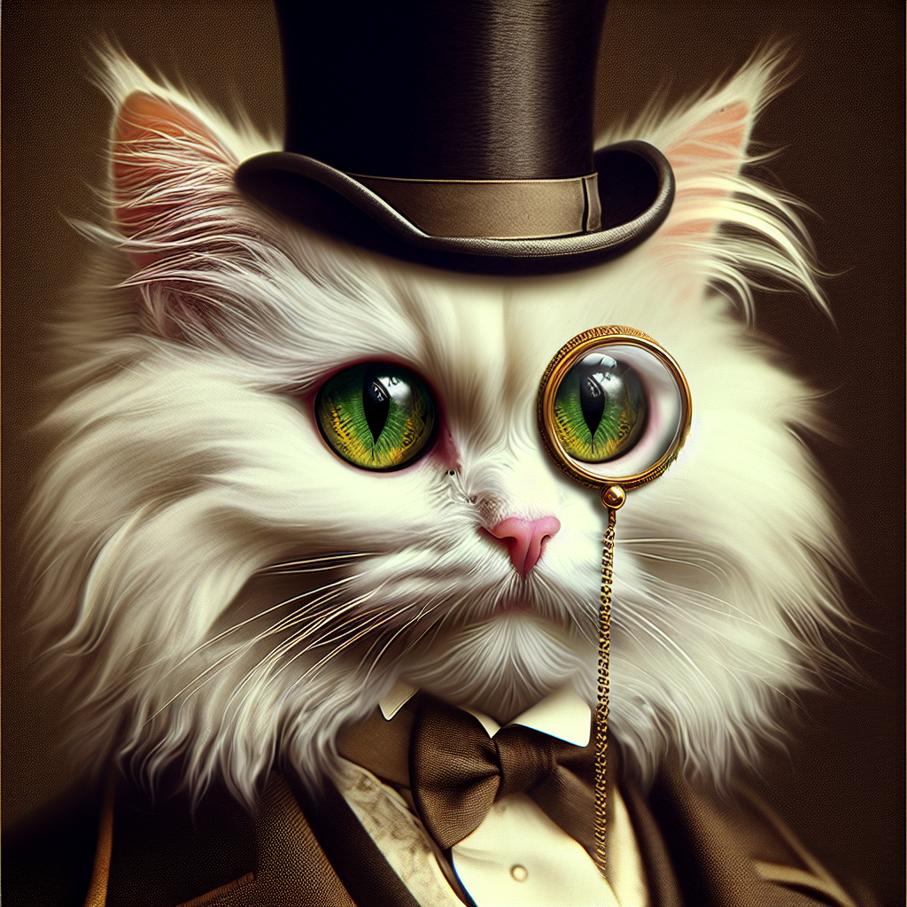

# Image Gallery

*A hyper-realistic image of a domestic cat dressed as a Victorian-era lady. The cat possesses elegant and charm typically associated with Victorian ladies. Her attire includes a rich, opulent dress filled with lace and ribbons, a feathered hat, and a dainty parasol. Her expression is regal and content. The background is soft, suggesting a room adorned with Victorian-era furniture and ornate wallpaper. Light filters in from a nearby window, casting a warm, inviting glow on the scene.*

![Create a photorealistic image of a cat transform into a Victorian lady. She's donned in full Victorian-era attire. Think of large frilly dresses with a fitted bodice, lace collars that extend up to the neck, puffed shoulders, and an extravagant feathered hat. She also has small spectacles hanging from a gold chain around her neck. Instead of a human face, it's a realistic cat's face, maintaining detail of its lush whiskers and expressive eyes. The setting could be a richly adorned Victorian parlor, with the accompanying lush wallpaper, luxurious furniture, and intricate details that encapsulate the era.](./img/Victorian_Cats_1.png)

*Create a photorealistic image of a cat transform into a Victorian lady. She's donned in full Victorian-era attire. Think of large frilly dresses with a fitted bodice, lace collars that extend up to the neck, puffed shoulders, and an extravagant feathered hat. She also has small spectacles hanging from a gold chain around her neck. Instead of a human face, it's a realistic cat's face, maintaining detail of its lush whiskers and expressive eyes. The setting could be a richly adorned Victorian parlor, with the accompanying lush wallpaper, luxurious furniture, and intricate details that encapsulate the era.*

*Generate a photo-realistic image of a cat dressed in the style of a Victorian-era lady. The cat should be sitting upright, wearing an elaborate dress with ample frills and lace detailing, characteristic of the fashion of the late nineteenth-century England. The outfit should also include a matching bonnet tied under her chin. The cat should be portrayed with a regal expression, like that of a real Victorian lady of high stature.*

![Create a photorealistic image of a feline creature, imagined as a Victorian-era lady. The cat should possess the elegant and sophisticated look that a woman of status would have during this time period. The creature can be adorning a high neck, full-sleeved dress in rich, dark hues, typical of the Victorian era. Compliment the attire with appropriate accessories like a bonnet, cameo brooch and lace gloves. The ambiance can be reminiscent of a classic Victorian interior with ornate furniture, patterned wallpapers, and oil paintings.](./img/Victorian_Cats_3.png)

*Create a photorealistic image of a feline creature, imagined as a Victorian-era lady. The cat should possess the elegant and sophisticated look that a woman of status would have during this time period. The creature can be adorning a high neck, full-sleeved dress in rich, dark hues, typical of the Victorian era. Compliment the attire with appropriate accessories like a bonnet, cameo brooch and lace gloves. The ambiance can be reminiscent of a classic Victorian interior with ornate furniture, patterned wallpapers, and oil paintings.*

*Generate a photorealistic image of a domestic cat dressed up as a Victorian lady, possessing typical attire from that era such as a lace bonnet, a long fitted bodice with puffed sleeves and a wide full skirt, carrying a lace-imprinted folding fan in her paw. She has the expressive, curious eyes and a silky fur coat.*

![Create a hyper-realistic image of a domestic cat. However, this is not an ordinary pet cat. This cat walks on its hind legs, donned with regalia typical of a Victorian period gentleman. The feline has sophistication oozing from its demeanor and its appearance. It might be wearing a vest, a crisp white shirt, an intricately patterned cravat tied loosely around its neck, along with a coat worn over the shoulders. It holds a cane in one paw, and a top hat is perched on its head. Despite its clothing, also make sure the cat's distinctive feline features are still clearly recognizable underneath all that elegance.](./img/Victorian_Cats_5.png)

*Create a hyper-realistic image of a domestic cat. However, this is not an ordinary pet cat. This cat walks on its hind legs, donned with regalia typical of a Victorian period gentleman. The feline has sophistication oozing from its demeanor and its appearance. It might be wearing a vest, a crisp white shirt, an intricately patterned cravat tied loosely around its neck, along with a coat worn over the shoulders. It holds a cane in one paw, and a top hat is perched on its head. Despite its clothing, also make sure the cat's distinctive feline features are still clearly recognizable underneath all that elegance.*

![Generate a photorealistic depiction of a cat donned in Victorian-era gentleman's attire. The feline should appear dignified and refined, complete with a tailcoat, a waistcoat, a cravat, classy trousers, and polished black boots. The grooming of its fur should suggest sophistication, and it should carry the confident gaze of an aristocrat. Its paws should be posed in a manner that indicates high breeding, perhaps resting on a walking cane. The backdrop can be a tastefully decorated room featuring period-appropriate architecture, furnishings, wallpapers, and various artifacts of gentility.](./img/Victorian_Cats_6.png)

*Generate a photorealistic depiction of a cat donned in Victorian-era gentleman's attire. The feline should appear dignified and refined, complete with a tailcoat, a waistcoat, a cravat, classy trousers, and polished black boots. The grooming of its fur should suggest sophistication, and it should carry the confident gaze of an aristocrat. Its paws should be posed in a manner that indicates high breeding, perhaps resting on a walking cane. The backdrop can be a tastefully decorated room featuring period-appropriate architecture, furnishings, wallpapers, and various artifacts of gentility.*

![Create a photorealistic image of a cat portraying the role of a Victorian gentleman. The cat should be standing upright on its hind legs, donned in typical Victorian era attire, including a black frock coat, matching waistcoat, white high-collared shirt, and a cravat around its neck. It should also be wearing a top hat and monocle, and holding a cane with an ornate handle in one paw, reflecting the norms of the Victorian era's high society. The surrounding should be a posh, warm colored, Victorian-era study room, replete with antique furniture, books, and artworks.](./img/Victorian_Cats_7.png)

*Create a photorealistic image of a cat portraying the role of a Victorian gentleman. The cat should be standing upright on its hind legs, donned in typical Victorian era attire, including a black frock coat, matching waistcoat, white high-collared shirt, and a cravat around its neck. It should also be wearing a top hat and monocle, and holding a cane with an ornate handle in one paw, reflecting the norms of the Victorian era's high society. The surrounding should be a posh, warm colored, Victorian-era study room, replete with antique furniture, books, and artworks.*

![Generate a photorealistic image of a domestic cat depicted as a Victorian era gentleman. The cat should have elements of Victorian fashion such as a high stiff collar, cravat, waistcoat, and top hat. The setting includes details that one would find in the parlors of Victorian homes such as embroidered chairs, wallpaper with intricate patterns, potted ferns, and a fireplace with a mirror above it. The cat's features should remain true to its species, with expressive eyes, a sleek fur coat, and whiskers, while the attire and setting establish its gentlemanly persona.](./img/Victorian_Cats_8.png)

*Generate a photorealistic image of a domestic cat depicted as a Victorian era gentleman. The cat should have elements of Victorian fashion such as a high stiff collar, cravat, waistcoat, and top hat. The setting includes details that one would find in the parlors of Victorian homes such as embroidered chairs, wallpaper with intricate patterns, potted ferns, and a fireplace with a mirror above it. The cat's features should remain true to its species, with expressive eyes, a sleek fur coat, and whiskers, while the attire and setting establish its gentlemanly persona.*

*Visualize a photo-realistic feline embodying the persona of a Victorian-era gentleman. This cat exudes style and sophistication, equipped with traditional Victorian gentleman attire. Imbue the image with the cat possessing features of a feline, yet having a dignified stance and demeanor characteristic of a human gentleman from the Victorian age. While ensuring the realistic representation, add details like a top hat, a monocle, and a well-tailored suit to the cat, embellishing its genteel image.*

![Create a photorealistic image of a white angora cat dressed and styled as a Victorian lady. The cat should be adorned in an intricately designed gown typical of the late 19th century, with ruffled collars, puff sleeves, and voluminous skirts. The cat's face should convey a serene and dignified demeanour, expressing the elegance and refinement characteristic of Victorian high society. The setting can be a richly decorated Victorian drawing room, with elements such as a fireplace, ornate wallpaper, antique furniture, and lavish drapes.](./img/Victorian_Cats_10.png)

*Create a photorealistic image of a white angora cat dressed and styled as a Victorian lady. The cat should be adorned in an intricately designed gown typical of the late 19th century, with ruffled collars, puff sleeves, and voluminous skirts. The cat's face should convey a serene and dignified demeanour, expressing the elegance and refinement characteristic of Victorian high society. The setting can be a richly decorated Victorian drawing room, with elements such as a fireplace, ornate wallpaper, antique furniture, and lavish drapes.*

![Create a photorealistic image of a white Angora cat dressed in Victorian-era fashion. The cat is styled to represent a lady from that period, complete with all the affluence and elegance associated with Victorian ladies. The cat is fluffy, with radiant white fur, and its eyes add the charm of wisdom and subtlety. It is stunningly dressed in a classic Victorian gown, rich in detail and embroidery, accompanied by all the essential accessories, namely a lace parasol, a petite purse, and a pearl necklace. The image should carry the ethos of the Victorian period and the regality of a Victorian lady.](./img/Victorian_Cats_11.png)

*Create a photorealistic image of a white Angora cat dressed in Victorian-era fashion. The cat is styled to represent a lady from that period, complete with all the affluence and elegance associated with Victorian ladies. The cat is fluffy, with radiant white fur, and its eyes add the charm of wisdom and subtlety. It is stunningly dressed in a classic Victorian gown, rich in detail and embroidery, accompanied by all the essential accessories, namely a lace parasol, a petite purse, and a pearl necklace. The image should carry the ethos of the Victorian period and the regality of a Victorian lady.*

*A photo-realistic image of an elegant white angora cat personified as a Victorian era lady, with all the associated attire. She's donned in exquisite Victorian fashion, garments made of silk and lace, and accessories such as a bonnet or a parasol. All portrayed whilst maintaining the essential feline characteristics, like the fluffy white coat and feline eyes.*

*Create a detailed, photo-realistic image of a white angora cat portrayed as a Victorian-era lady. This elegant feline should be dressed in period-appropriate attire, featuring a high-neck blouse, lace-up boots, and a full, sweeping skirt. Accessories such as a bonnet or parasol could also be included. The background could be a well-furnished Victorian room with ornate designs, complete with a plush chair or chaise lounge where the cat is luxuriously seated.*

*Create a photorealistic image of a white Angora cat embodied as a Victorian-era lady. She should be adorned in Victorian fashion with a high-necked and full-sleeved elegant dress, corseted waistline, prime hat adorned with feathers, and an intricate parasol. The cat's features should still be prominent, with soft, fluffy white fur, and its distinct blue eyes.*

![Detailed scene of a photorealistic white Angora cat, morphed to give her the appearance of a Victorian-era lady. Include green eyes for the cat. She is adorned with typical Victorian fashion elements: a high-collared lace blouse, an embroidered bodice, a full-length skirt in rich fabrics, and a bonnet or hat with ribbons. To complete the look, she has small, delicate jewelry, perhaps a locket or a cameo brooch. The setting she is in consists of picturesque Victorian elements such as a chic, posh room decorated with elaborate wallpaper, vintage furniture, and ornamental plants.](./img/Victorian_Cats_15.png)

*Detailed scene of a photorealistic white Angora cat, morphed to give her the appearance of a Victorian-era lady. Include green eyes for the cat. She is adorned with typical Victorian fashion elements: a high-collared lace blouse, an embroidered bodice, a full-length skirt in rich fabrics, and a bonnet or hat with ribbons. To complete the look, she has small, delicate jewelry, perhaps a locket or a cameo brooch. The setting she is in consists of picturesque Victorian elements such as a chic, posh room decorated with elaborate wallpaper, vintage furniture, and ornamental plants.*

*A photo-realistic image of a white Angora cat with vibrant green eyes. Imagined as a Victorian lady, it is wearing a lavish pearl necklace and a lace bonnet, poshly seated in a vintage Victorian chair. The scene is set in an opulent parlour adorned with gold-trimmed furniture and damask-patterned wallpaper, glowing with the warm light of gas lamps.*

![Create a highly detailed photorealistic image featuring a white angora cat with vibrant green eyes, imagining this feline as a Victorian era lady. The cat should be adorned in customary Victorian clothing, which is typically a high-necked, ruffled gown in a jewel tone. Her fur should look pristine and fluffy, accentuating the angora breed's distinct fur texture. The backdrop can be an ornate Victorian parlor with velvet drapes and gilded furniture. The overall feel of the image should have echoes of the intricate design and formal etiquette associated with the Victorian era.](./img/Victorian_Cats_17.png)

*Create a highly detailed photorealistic image featuring a white angora cat with vibrant green eyes, imagining this feline as a Victorian era lady. The cat should be adorned in customary Victorian clothing, which is typically a high-necked, ruffled gown in a jewel tone. Her fur should look pristine and fluffy, accentuating the angora breed's distinct fur texture. The backdrop can be an ornate Victorian parlor with velvet drapes and gilded furniture. The overall feel of the image should have echoes of the intricate design and formal etiquette associated with the Victorian era.*

*A photorealistic image of a white angora cat with striking green eyes. The cat is personified as a Victorian-era lady, dressed elaborately in the classic clothing of the time. The clothing exhibits a high level of detail and embodies the sophisticated, conservative style that typifies the Victorian era, including a high-necked blouse, a long, full skirt, and an ornate hat. The cat carries herself with an air of dignified grace and charm.*

*A photorealistic depiction of a white Angora cat with vivid green eyes, transformed into a Victorian-era lady. The feline has an aura of elegance as it dons attire typical of a Victorian lady, including a voluminous and intricate dress in pastel hues, a bonnet adorned with delicate lace, and a pearl necklace. The cat maintains its distinctive furry appearance but adopts human-like posture and expressions, showcasing both its animalistic traits and its anthropomorphic character.*

*Create a photo realistic image of a white angora cat possessing green eyes with hints of yellow. The eyes of the feline should be depicted as almond-shaped. The cat is adorned with victorian-era lady's attire, capturing the essence and intricacy of the 19th-century fashion. The image should resonate the vibe of vintage chronicle and pays homage to the keen details and elegance associated with the victorian period.*

*Generate an image of an photorealistic white angora cat, featuring vivid green eyes with a rare hint of yellow. The cat's eyes should defy the norm with their unique almond shape. This cat isn't just any cat, but a sophisticated victorian lady, providing an aesthetic blend of the late 19th century's high-society elegance with the charm of a feline grace.*

*Generate a photo-realistic image of a white angora cat with almond shaped eyes that have a hue of green with a hint of yellow. This cat is not just an ordinary one but personifies a Victorian lady. Visualize her donned in Victorian-era clothing, embodying elegance and sophistication of a bygone era. *

![Depict a realistic image of a white Angora cat. The cat has eyes that are green with a hint of yellow and feature an enigmatic almond shape. However, this isn't any usual feline. The unique aspect of this cat is that it embodies the appearance of a Victorian lady. This includes adorned in an elaborate Victorian dress, and typical associated hairstyles and accessories of that era. The overall image should create an intriguing combination of the delicate features of a cat and the vintage elegance of a Victorian lady.](./img/Victorian_Cats_23.png)

*Depict a realistic image of a white Angora cat. The cat has eyes that are green with a hint of yellow and feature an enigmatic almond shape. However, this isn't any usual feline. The unique aspect of this cat is that it embodies the appearance of a Victorian lady. This includes adorned in an elaborate Victorian dress, and typical associated hairstyles and accessories of that era. The overall image should create an intriguing combination of the delicate features of a cat and the vintage elegance of a Victorian lady.*

*Generate a photorealistic image of a white Angora cat with green eyes exhibiting a touch of yellow. These eyes should be almond-shaped. Also, portray the cat in the style of a Victorian lady dressed in typical Victorian fashion, complete with a bonnet, and a lace-trimmed dress.*

![Create a photorealistic image of a white Angora cat. The cat has green eyes with a hint of yellow, and they are almond-shaped. This cat is not your ordinary pet, as it is depicted as a Victorian-era Steampunk lady. The cat is wearing traditional Steampunk attire complete with brass goggles, layered skirts, corsets and lace-up boots. Background is a detailed Victorian interior accented with steampunk elements—gears, springs and cogwheels, with a color scheme favoring brass, sepia and hues of brown and cream.](./img/Victorian_Cats_25.png)

*Create a photorealistic image of a white Angora cat. The cat has green eyes with a hint of yellow, and they are almond-shaped. This cat is not your ordinary pet, as it is depicted as a Victorian-era Steampunk lady. The cat is wearing traditional Steampunk attire complete with brass goggles, layered skirts, corsets and lace-up boots. Background is a detailed Victorian interior accented with steampunk elements—gears, springs and cogwheels, with a color scheme favoring brass, sepia and hues of brown and cream.*

![An image of an impeccably detailed, photo-realistic white Angora cat. The cat boasts enchanting, almond-shaped eyes, the color of lush green leaves with a mild dash of sunny yellow. The intriguing aspect of this feline is that it is whimsically personified as a Victorian-era lady, draped in the grandeur of Steampunk fashion. The Victorian clothing incorporates elements from the Steampunk genre, such as intricate gears, finely carved metallic accessories, and a fascinating assortment of avante-garde elements. The overall composition pays homage to the refined elegance of Victorian women and the imaginative depth of Steampunk culture.](./img/Victorian_Cats_26.png)

*An image of an impeccably detailed, photo-realistic white Angora cat. The cat boasts enchanting, almond-shaped eyes, the color of lush green leaves with a mild dash of sunny yellow. The intriguing aspect of this feline is that it is whimsically personified as a Victorian-era lady, draped in the grandeur of Steampunk fashion. The Victorian clothing incorporates elements from the Steampunk genre, such as intricate gears, finely carved metallic accessories, and a fascinating assortment of avante-garde elements. The overall composition pays homage to the refined elegance of Victorian women and the imaginative depth of Steampunk culture.*

![A photo-realistic depiction of a white angora cat, boasting almond-shaped eyes carrying a lustrous mixture of green and flickers of yellow. This unique feline isn't just any cat - she's a lady belonging to the Victorian era, styled in traditional Steampunk fashion. Her clothing echoes an alternate reality, where steam power reigns supreme and complexities of machinery define elegance. Expect elements of vintage-style gowns, layered fabrics, ruffled collars, cogwheels, pocket watches and brass goggles nuanced in a manner that blends the antique with the industrial, the exquisite with the mechanical.](./img/Victorian_Cats_27.png)

*A photo-realistic depiction of a white angora cat, boasting almond-shaped eyes carrying a lustrous mixture of green and flickers of yellow. This unique feline isn't just any cat - she's a lady belonging to the Victorian era, styled in traditional Steampunk fashion. Her clothing echoes an alternate reality, where steam power reigns supreme and complexities of machinery define elegance. Expect elements of vintage-style gowns, layered fabrics, ruffled collars, cogwheels, pocket watches and brass goggles nuanced in a manner that blends the antique with the industrial, the exquisite with the mechanical.*

![Generate an image of a photorealistic white Angora cat with almond-shaped eyes. The eyes should reflect a captivating blend of green with a subtle hint of yellow. This feline grace is not any typical cat, but a Victorian lady living a Steampunk lifestyle. Picture her adorned with attire from this era, which could include items like lace-up boots, a corset, a bustle skirt, and perhaps a pair of goggles resting on her furry head. Flower embellishments and ornate jewelry would not be out of place. Immerse in this fanciful blend of historic and speculative fiction.](./img/Victorian_Cats_28.png)

*Generate an image of a photorealistic white Angora cat with almond-shaped eyes. The eyes should reflect a captivating blend of green with a subtle hint of yellow. This feline grace is not any typical cat, but a Victorian lady living a Steampunk lifestyle. Picture her adorned with attire from this era, which could include items like lace-up boots, a corset, a bustle skirt, and perhaps a pair of goggles resting on her furry head. Flower embellishments and ornate jewelry would not be out of place. Immerse in this fanciful blend of historic and speculative fiction.*

![Create an image of a photorealistic white Angora cat with enticing almond-shaped eyes that carry a mesmerising blend of green with a faint tint of yellow. This feline beauty is personified as a Victorian-era lady immersed in the fascinating world of Steampunk. She's adorned with an assortment of gears, cogs, and metallic accessories that are characteristic of the Steampunk aesthetic, while also wearing an elaborate Victorian dress. This image captures a unique fusion of elegance, whimsicality, and technological fascination, maintaining a strong sense of historical romanticism coupled with a creative reinterpretation of technology.](./img/Victorian_Cats_29.png)

*Create an image of a photorealistic white Angora cat with enticing almond-shaped eyes that carry a mesmerising blend of green with a faint tint of yellow. This feline beauty is personified as a Victorian-era lady immersed in the fascinating world of Steampunk. She's adorned with an assortment of gears, cogs, and metallic accessories that are characteristic of the Steampunk aesthetic, while also wearing an elaborate Victorian dress. This image captures a unique fusion of elegance, whimsicality, and technological fascination, maintaining a strong sense of historical romanticism coupled with a creative reinterpretation of technology.*

![A photo-realistic depiction of an elegant white angora cat radiating with aristocracy. The cat possesses stunning almond-shaped eyes that express a unique blend of deep green and a slight hint of yellow, attributing it a mesmerizing gaze. The cat is embellished with opulent Victorian-themed attire, identifying it as a high-ranking lord in the era of steampunk. The wardrobe likely consists of brocaded waistcoats, button-up shirts, adorned top hat and an antique pocket-watch to reflect its societal stature amidst the steampunk aesthetic.](./img/Victorian_Cats_30.png)

*A photo-realistic depiction of an elegant white angora cat radiating with aristocracy. The cat possesses stunning almond-shaped eyes that express a unique blend of deep green and a slight hint of yellow, attributing it a mesmerizing gaze. The cat is embellished with opulent Victorian-themed attire, identifying it as a high-ranking lord in the era of steampunk. The wardrobe likely consists of brocaded waistcoats, button-up shirts, adorned top hat and an antique pocket-watch to reflect its societal stature amidst the steampunk aesthetic.*

*Create a photorealistic image of a white angora cat. The cat's eyes should be almond-shaped, with a color palette of green with hints of yellow. Dress the cat as a lord in the Victorian steampunk fashion; complete with a stylish top hat, a well-tailored waistcoat, and a monocle. The cat is showcasing a confident and aristocratic demeanor.*

*A photo-realistic image of a white Angora cat, characterized by green eyes with a hint of yellow and almond in shape. The cat is imagined in the attire of a Victorian steampunk lord, adorned with intricate gears, goggles, brass detailing, and intricate clockwork motifs. Dressed in a richly-textured, Victorian-style tailcoat, the feline effortlessly embraces the aesthetic of the steampunk subculture.*

*Generate a photo-realistic image of a white Angora cat with green almond-shaped eyes, tinged with a hint of yellow. The cat is also portrayed as a Victorian-era lord in the steampunk style, complete with top hat, monocle, and fine Victorian attire.*

*A realistic portrayal of a white Angora cat with green almond-shaped eyes that have a hint of yellow. This cat is not an ordinary one but a dignified 'lord' character from the Victorian era. It's adorned in a stylish steampunk attire, complete with the aesthetics and technology from 19th-century industrial steam-powered machinery.*

