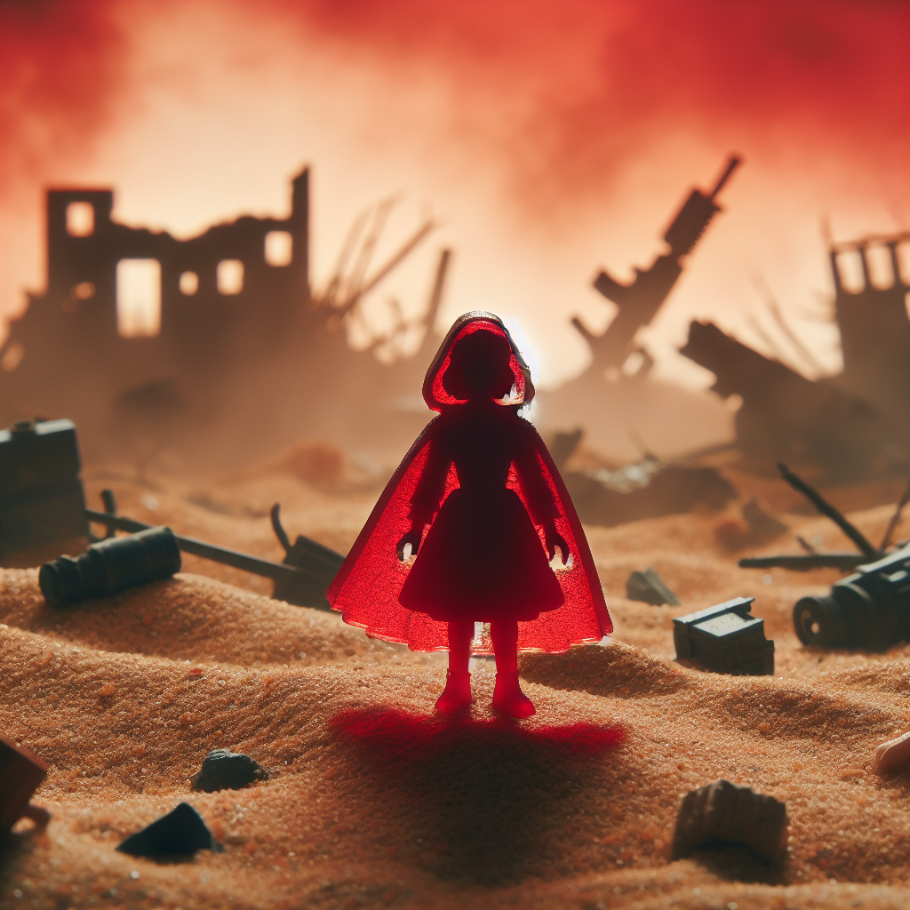

# Caperucita Roja en el Desierto Apocalíptico

En un mundo no tan lejano, donde la tecnología y la magia se mezclaban de manera volátil, vivía una joven llamada Caperucita Roja. Su nombre era una herencia de su abuela, cuya fama en los cuentos antiguos hacía eco a través de las dimensiones. Pero nuestra Caperucita no vivía en un frondoso bosque, sino en un vasto y calcinante desierto, donde las dunas ocultaban secretos de un pasado bélico.

Caperucita era una mensajera, una de las últimas, encargada de llevar información y recursos entre los pequeños asentamientos que todavía resistían en aquel desierto devastado por la guerra. El manto rojo que llevaba no era solo una marca de su herencia, sino también una armadura imbuida con magia protectora contra los disparos láser y las explosiones que eran una amenaza constante en su diario vivir.

Un día, mientras Caperucita cruzaba una zona particularmente peligrosa conocida como el Valle de las Tormentas, la guerra decidió hacer de las suyas. Considerado un lugar neutral en la constante batalla entre las facciones enemigas, el Valle era utilizada como una ruta de tránsito rápido por aquellos lo suficientemente valientes para arriesgarse. Pero esa falsa paz fue repentinamente interrumpida cuando el cielo se encendió con un fuego furioso y las primeras explosiones comenzaron a estremecer la tierra.

Los rumores de un arma devastadora eran ciertos. Las facciones habían decidido ignorar la tregua y la neutralidad del Valle mientras luchaban por el control total del desierto. Caperucita sintió cómo las ondas de las explosiones impactaban contra su capa, cada hechizo de protección absorbiendo los golpes que de otro modo la habrían desmembrado.

Con urgencia y agilidad, Caperucita maniobró entre las derrumbadas estructuras y cráteres humeantes que una vez fueron oasis de pacíficos comerciantes. En su mochila llevaba medicinas para una aldea que las necesitaba desesperadamente. No podía permitirse el lujo de perder tiempo. A su paso, las máquinas de guerra se desplegaban, desenterrando la arena con sus orugas de metal y disparando al cielo, buscando alcanzar a los drones que zumbaban como avispas molestas.

Caperucita, haciendo uso de su velocidad y conocimiento del terreno, evitaba los enfrentamientos directos, su silueta roja apenas visible contra el polvo y la destrucción. Sabía que si era detectada, ningún hechizo podría salvarla del torrente de fuego y metal que sin duda vendría. Pero también conocía las profecías, aquellas que hablaban de una mensajera en rojo que traería la paz al desierto, y ella estaba determinada a ser esa esperanza.

Cuando finalmente llegó a su destino, la aldea bajo sitio reconoció de inmediato la icónica capa roja. Con el último aliento de su magia, Caperucita entregó las medicinas justo antes de que su protección fallara y su capucha cayera a su espalda. La guerra, sin embargo, no estaba lista para dejarla ir tan fácilmente.

"¿Y si yo le pongo que está Caperucita Roja en un desierto en plena guerra y todo explota?", exclamó un narrador omnisciente, mientras una nueva explosión llenaba el horizonte. Pero Caperucita Roja no era solo un personaje de una historia que podía ser descartado. Ella tenía una misión, y no iba a ceder ante el caos.

Con valentía y determinación, Caperucita se enfrentó no solo a las adversidades del desierto y de la guerra, sino también a la imprevisibilidad del narrador. En un acto de rebelión contra su destino escrito, reunió a las facciones y les mostró que la verdadera destrucción venía de su incesante lucha. Ahí mismo, en el corazón de las llamas y el estruendo, Caperucita Roja comenzó a tejer un nuevo cuento, uno en el que la guerra finalmente cedía ante la paz, y donde el desierto volvía a florecer en un oasis de esperanza.

