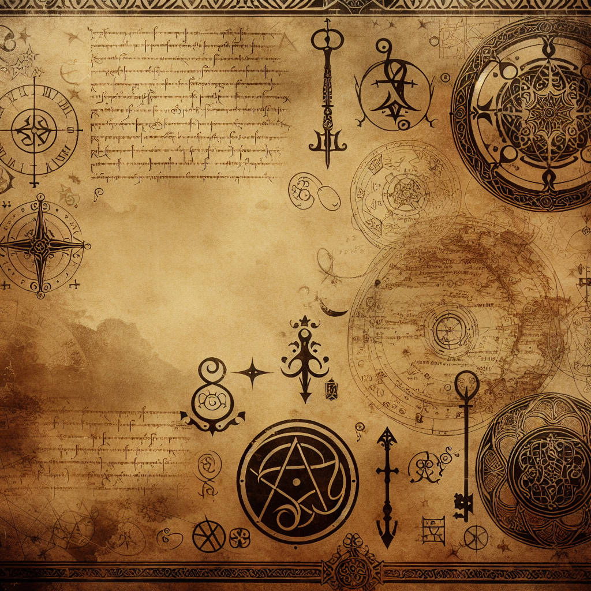

# Image Gallery

*Design an image of a vintage style background parchment, inspired by the aesthetics of fantasy-themed, interactive adventure books from the 1980s. The paper texture should resemble aged manuscript paper, slightly yellowish, worn out, used and occasionally stained. It's decorated with faded prints of arcane symbols, heraldic crests, and mythical creatures, suiting a setting of magical quests and adventurous journeys. Please avoid any direct reference to specific copyrighted works or authors.*

*Generate an image of a background paper reminiscent of the fantasy genre, with touches of mystery and adventure, similar to the tone found in traditional adventure paperbacks written before 1912. The paper should suggest a sense of enigma, presenting details such as intricate borders, faded parchment texture, and faint imagery related to magical symbols, ancient maps, and other mystical elements.*

*An antique background paper influenced by classic fantasy tabletop role-playing games. The paper should exhibit signs of age like discoloration and fraying, along with minimalistic, primitive but captivating etchings or symbols often seen in those games. The general atmosphere should be one of mystery and adventure.*

*Design a textured paper background akin to the pages found in classic fantasy role-playing books. Let it have an old, worn out feel with faded colors and carefully illustrated borders filled with mystical symbols, mythical creatures, and ancient scripts. Think of a parchment that's been careworn from lots of use, with ink blots and undefined spots.*

*Generate an image of a background paper illustrating elements of fantasy and high adventure. The paper should have aged, sepia tones reminiscent of vintage cartography, and filled with creative elements such as mythical creatures, various terrains like mountains, forests and seas, mystical symbols, and old-style typography. It should convey the aura of classic fantasy board games and old adventure plot books.*

![Create an image of a background paper infused with the spirit of mystical enchantment, similar to the feeling that old adventure gamebooks or interactive fiction narratives from authors like Steve Jackson typically evoke. The paper should be weathered and yellowed, much like a vintage parchment or scroll, and adorned with intricate black ink etchings of arcane symbols, mythical creatures and an ancient-looking map filled with treacherous terrains, mysterious landmarks, and dangerous paths. Do not include any copyrighted characters or specific references to the Sourcery! books, but rather, build an image that captures the general ambiance.](./img/sorcery_39.png)

*Create an image of a background paper infused with the spirit of mystical enchantment, similar to the feeling that old adventure gamebooks or interactive fiction narratives from authors like Steve Jackson typically evoke. The paper should be weathered and yellowed, much like a vintage parchment or scroll, and adorned with intricate black ink etchings of arcane symbols, mythical creatures and an ancient-looking map filled with treacherous terrains, mysterious landmarks, and dangerous paths. Do not include any copyrighted characters or specific references to the Sourcery! books, but rather, build an image that captures the general ambiance.*

![A background paper image capturing the spirit of old interactive gamebooks. The paper should have a worn, yellowed appearance, as if it has seen many hands and many years. The edges should be slightly rough, mimicking the side effects of long-term use, and there should be slight creases and folds scattered throughout the paper. The texture should be similar to that of a well-worn book page, with noticeable grain and pattern. Hints of stains, perhaps from spilled beverages or smudged ink, are to be present, adding to the feel of an artifact from a different era.](./img/sorcery_45.png)

*A background paper image capturing the spirit of old interactive gamebooks. The paper should have a worn, yellowed appearance, as if it has seen many hands and many years. The edges should be slightly rough, mimicking the side effects of long-term use, and there should be slight creases and folds scattered throughout the paper. The texture should be similar to that of a well-worn book page, with noticeable grain and pattern. Hints of stains, perhaps from spilled beverages or smudged ink, are to be present, adding to the feel of an artifact from a different era.*

*A background paper designed to evoke the feeling of classic fantasy books. Capture elements such as worn parchment, vibrant magical symbols, and elements that create an immersive atmosphere like intricate borders or small illustrations hinting at grand adventures and mythical creatures. The design should have a nostalgic touch, reminiscent of the feeling one would get from reading old choose-your-own-adventure type books.*

*Depict a backdrop that replicates the visual essence of a classic adventure book, reminiscent of fantasy tales filled with enchantments and conjurations. Include elements of epigraphy, containing cryptic hieroglyphs and mythical symbols. The paper should display wear and age, as though it has been well-used in countless magical battles. Also, hint towards the element of exploration and heroic quests subtly embedded within the paper's design.*

*A background image that features a mystical and adventurous quality, similar to the theme of classic fantasy literature. This image should incorporate elements of ornate design, intricate maps, and imaginative creatures to evoke the sense of embarking on a fantastical journey through unknown lands, much like the aesthetic from vintage role-playing game books.*

*Create an image of a background paper that mimics the nostalgic and captivating style of a choose-your-own-adventure book from the 1980s. The paper texture should be slightly coarse with soft yellowish-brown tones to resemble aged paper. Elements of fantasy such as ancient emblems, crests, or border embellishments that are typically found in mystical adventure books should lightly adorn the edges.*

*Create an image of a background paper that replicates the look and feel of vintage fantasy literature, kindred to the aesthetics fundamentally associated with renowned gamebooks of the 1980s. The style should evoke feelings of mystique, adventure, and fantastical realms. Imagine a parchment embodying tales of magic and valor, imprinted with symbols of enchantment and heroism, weathered, and aged, like it's been on numerous journeys through magical realms.*

![Create an image that replicates the feel of a background paper found in classic fantasy adventure books. It should look aged with darkened corners, textured with wrinkles and smudges from numerous hands leafing through it. The page is filled with an exotic map, filled with unnamed lands, vast oceans, towering mountains, and winding paths that hint at the countless adventures that lie ahead. The artistry employed should be reminiscent of the pre-1912 era, with the attention to detail and evocative storytelling of classic cartography.](./img/sorcery_13.png)

*Create an image that replicates the feel of a background paper found in classic fantasy adventure books. It should look aged with darkened corners, textured with wrinkles and smudges from numerous hands leafing through it. The page is filled with an exotic map, filled with unnamed lands, vast oceans, towering mountains, and winding paths that hint at the countless adventures that lie ahead. The artistry employed should be reminiscent of the pre-1912 era, with the attention to detail and evocative storytelling of classic cartography.*

*A background resembling vintage parchment, covered in sketched lines and textures that allude to mystical symbols and ancient texts. The color scheme should mimic aged paper - tawny shades, faint sepia touches, and faint lines. Maintain the feel of an old adventure fantasy book, like the ones from the medieval period. Detailed edges should be worn and distressed, hinting at a well-travelled and extensively used item.*

*Generate an image of a parchment or background paper that resembles the aesthetic of fantasy adventure gamebooks popular in the 1980s. This paper background should have worn edges, faded markings, and imprinted symbols or markings associated with magic and sorcery. The overall atmosphere should ooze of enchantment and adventure, capturing the nostalgic essence of traditional role-playing games.*

*A piece of vintage, parchment-like paper that resembles the background used in classic fantasy adventure books. It should look worn and slightly browned with age, with the intricate detailings and markings often seen in ancient, magical tomes. Imaginative texts and drawings of mystical elements can be spotted sporadically. Please refrain from any direct or indirect references to specific copyrighted characters or titles.*

*Create an image of a background paper that draws inspirations from classic fantasy literature with an detailed old map, gothic styled borders, and fantasy-themed illustrations spread throughout the paper. The map looks like it's for a vast mysterious land, filled with mountains, forests, rivers, and castles. The whole paper has a vintage feel with discolored brownish edges making it look aged and timeless, like it has seen many years and tales of sorcery.*

*A background paper presenting a vintage, fantastical theme reminiscent of the evocative mood found in traditional storybooks. The paper should feature well-worn edges, with yellowing and tattered marks suggesting age and heavy use. Artistic motifs related to magic and sorcery, such as ancient runes, mystical symbols, and mythical creatures, could be subtly interwoven into the design, echoing the rich lore found in old fairy tales and fables.*

*A background paper with a medieval fantasy theme. Like those often used in vintage role-playing game books. This paper should include aged effect add-ons, faint writings and symbols related to old magical practices, and perhaps a primitive map or two.*

![A background paper texture designed to evoke the feel of a vintage fantasy book, with elements that suggest mystical elements and adventure. The paper should appear aged and worn, like a well-loved tome from a dusty old library. It might feature slight discolorations and textures that mimic the natural aging of paper over time. The edges of the paper may look lightly frayed or torn. To further hint to the fantasy genre, small illustrations of magical artifacts or mythical creatures might be subtly incorporated in the background design.](./img/sorcery_31.png)

*A background paper texture designed to evoke the feel of a vintage fantasy book, with elements that suggest mystical elements and adventure. The paper should appear aged and worn, like a well-loved tome from a dusty old library. It might feature slight discolorations and textures that mimic the natural aging of paper over time. The edges of the paper may look lightly frayed or torn. To further hint to the fantasy genre, small illustrations of magical artifacts or mythical creatures might be subtly incorporated in the background design.*

![Depict a background paper reminiscent of the aesthetics found in vintage fantasy novels. The image should capture the theme of an enchanting atmosphere filled with mystery and adventure akin to classic role-playing game books. Use rich, warm tones to reflect the old-world charm and combine that with elements of surprise that stimulate the sense of exploration in the reader. Aspects like mysterious symbols, faded corners or a hint of a subtle, magical aura can help reproduce the nostalgic retro vibe.](./img/sorcery_17.png)

*Depict a background paper reminiscent of the aesthetics found in vintage fantasy novels. The image should capture the theme of an enchanting atmosphere filled with mystery and adventure akin to classic role-playing game books. Use rich, warm tones to reflect the old-world charm and combine that with elements of surprise that stimulate the sense of exploration in the reader. Aspects like mysterious symbols, faded corners or a hint of a subtle, magical aura can help reproduce the nostalgic retro vibe.*

*A background paper texture that invokes the feeling of classic adventure books, filled with maps, magical symbols and cryptic texts. The paper should bear the hue of aged parchment, worn with time. Hand-drawn illustrations of mystical artifacts, creatures, and landscape sketches from a fantasy universe should be scattered across it. The overall style should be detailed, intricate, and reminiscent of late 18th-century fantasy genre illustrations.*

![Generate an image of a background paper in the style reminiscent of old interactive gamebooks. The paper will have an aged look, possibly yellowed or browned with time with the corners slightly curled. It should feature antique typographic fonts, as well as old-fashioned, hand-drawn illustrations that would reflect a fantasy adventure theme. The content of the image could include fantasy map elements, mythical creatures, and medieval weaponry. Please avoid copying any specific elements from copyrighted sources.](./img/sorcery_44.png)

*Generate an image of a background paper in the style reminiscent of old interactive gamebooks. The paper will have an aged look, possibly yellowed or browned with time with the corners slightly curled. It should feature antique typographic fonts, as well as old-fashioned, hand-drawn illustrations that would reflect a fantasy adventure theme. The content of the image could include fantasy map elements, mythical creatures, and medieval weaponry. Please avoid copying any specific elements from copyrighted sources.*

*Create an image featuring a background paper that resembles the general aesthetic of a vintage fantasy novel. The paper should show signs of ageing, with its color similar to an old parchment-weathered and yellowish. On it, incorporate fantastical elements like ancient runes, arcane symbols, and perhaps a subtle magical aura. Remember to evoke a sense of intrigue, adventure, and mystery, echoing the essence of classic fantasy literature.*

*Create an image of a backdrop piece of parchment in the semblance of fantasy adventure books, characterized by a vintage feel, intricate borders around the edges, and faint markings of imaginary maps and cryptic scripts. The design should capture the essence of mystical enchantment, journeying through arcane realms, and epic quests.*

*An old paper texture that evokes nostalgia, similar to the pages of classic fantasy adventure books. The paper should have a yellowed, worn look to it, with perhaps a few minor creases and tiny rips to add to the well-loved, well-read feeling, reminiscent of ancient parchment. The overall style should encapsulate the aura of mythical sorcery and magic, as seen in timeless fantastical literature.*

*Generate an image representing a background paper that embodies the aesthetic of traditional fantasy role-playing books. Showcase aspects like worn-out parchment, artistic symbols related to magic and adventure, and an overall antique look as found in classic Sorcery-style games and novels. Ensure to capture the intricate details, frayed edges, ancient inscriptions and the sense of age-old wisdom contained within those pages.*

*A textured parchment background, reminiscent of classic fantasy adventure books. This backdrop should possess elements that convey timeless adventure and mystery. Tiny, sketched icons symbolizing elements of spellcasting, mythical creatures, and diverse terrains sporadically adorn the background, giving a feel of an old, bewitched grimoire or an ancient explorer's map. Use neutral, aged-paper colors, combined with black and brown for icons.*

*Visualize a background paper reminiscent of old fantasy gamebooks. Each line is drawn meticulously with a classic ink pen. The paper shows signs of weathering, complete with faded corners and smudged ink. Ancient symbols, similar to those used in magical texts, are scattered across the page, adding an element of mysticism and intrigue to the overall design. The page emits the charm of an era where adventure resided in every turn of the page.*

*Generate an image that captures the ambiance and art style typically found in fantasy adventure books from the late 20th century. The image should depict a parchment-resembling paper background. Include a detailed border with symbols and iconography related to magic, mystery, and adventure. Feature muted colors, intricate line work, and strong shading for a vintage feel.*

*Create an image of a parchment-like background that could be used as a page in a fantasy adventure book. The paper should appear aged and weathered, with visible texture. It should evoke a sense of mystery and adventure, reminiscent of illustrations and maps from classic fantasy literature.*

*Create an image simulating a background paper styled after old, fantasy role-playing game books. The imagined paper exudes a medieval aura, with yellowish tinges hinting at its ancientness, and worn-out edges depicting its frequent use. The surface is rich with text in Gothic lettering, and hand-drawn, intricate maps and sketches of mythical creatures are interspersed throughout, lending the paper a sense of mystery and adventure.*

*Visualize a backdrop featuring elements synonymous with fantasy literature. This image includes weathered parchment, ink splatters, faded maps, and mystical symbols, all exuding an antiquated feel. Play with colors akin to old, timeworn pages and ink - think muted browns, creamy whites, and muted blacks. The final accent is delicate artistic accents along the edges of the paper and subtle patina scattered on the surface to enhance the old-world charm and quintessential fantasy aesthetic.*

![Generate an image resembling an old, well-loved, and weathered book's background. It should embody the spirit of mystery, adventure, and fantasy, reminiscent of traditional interactive gamebooks. There should be visible crinkles and stains scattered throughout, adding to the impression of a parchment-like texture. Noticeable yet faint, ancient maps and cryptic runes should also be subtly present in the background. Note: Do not replicate any specific text or graphics from existing copyrighted content.](./img/sorcery_41.png)

*Generate an image resembling an old, well-loved, and weathered book's background. It should embody the spirit of mystery, adventure, and fantasy, reminiscent of traditional interactive gamebooks. There should be visible crinkles and stains scattered throughout, adding to the impression of a parchment-like texture. Noticeable yet faint, ancient maps and cryptic runes should also be subtly present in the background. Note: Do not replicate any specific text or graphics from existing copyrighted content.*

*Generate an image of a background paper that resembles the style found in vintage fantasy literature. This style typically includes a parchment-like texture, scattered imagery or iconography related to magic and adventure, and subtle, aged coloration. It might also feature intricate borders or runes, staying true to the enchanting theme.*

![An image of thick aged parchment reminiscent of centuries-old books, filled with intricate drawings of mystical symbols, maps of fictional lands, and diagrams of enchantments. The overall style is nostalgic and evokes the feel of an old-school fantasy role-playing game. Textured arcs and spatters, possibly of ink or wax seals, add character to the paper. The designs have deep, shadowy contrast, as if they were drawn using a well-used quill pen. Some areas of the paper might show spots of wear and tear or faded ink, enhancing the vintage look.](./img/sorcery_33.png)

*An image of thick aged parchment reminiscent of centuries-old books, filled with intricate drawings of mystical symbols, maps of fictional lands, and diagrams of enchantments. The overall style is nostalgic and evokes the feel of an old-school fantasy role-playing game. Textured arcs and spatters, possibly of ink or wax seals, add character to the paper. The designs have deep, shadowy contrast, as if they were drawn using a well-used quill pen. Some areas of the paper might show spots of wear and tear or faded ink, enhancing the vintage look.*

![Create an image of a background paper that mimics the aesthetic of vintage fantasy books, filled with intricate patterns and designs inspired by magic and sorcery. This paper has subtle tints of aged parchment, showing signs of natural weathering. The paper's borders are densely decorated with ornate motifs and symbols often associated with mystical and arcane arts. The main body of the paper is mainly clear but contains faint outlines of mystical symbols and arcane glyphs. The overall style should communicate an atmosphere of ancient wisdom and magical lore.](./img/sorcery_21.png)

*Create an image of a background paper that mimics the aesthetic of vintage fantasy books, filled with intricate patterns and designs inspired by magic and sorcery. This paper has subtle tints of aged parchment, showing signs of natural weathering. The paper's borders are densely decorated with ornate motifs and symbols often associated with mystical and arcane arts. The main body of the paper is mainly clear but contains faint outlines of mystical symbols and arcane glyphs. The overall style should communicate an atmosphere of ancient wisdom and magical lore.*

*A backdrop that draws inspiration from classic interactive narrative books. The visual elements should incorporate aged parchment texture, black and white line drawings that depict figures, monsters, and mythical landscapes typical of fantasy tales. Include elements such as ornate border designs and text blocks with old English fonts. Capture the feeling of embarking on a rich, epic adventure just through the scenery alone.*

*An atmospheric background paper that exudes the essence of fantasy and adventure, reminiscing of old role-playing books. Emphasize on ancient-looking paper with fine, subtle weathered textures. Include faint imprints of mystical symbols and arcane diagrams to enhance the magical atmosphere, much like classic fantasy adventure texts.*

*Generate an image with a background paper that closely resembles the aesthetic of a traditional fantasy book with hand-drawn illustrations, parchment aesthetic, and richly-detailed borders with intricate designs, keeping in mind the inspiration drawn from older narratives similar to classic fantasy literature.*

*Design a background paper that recalls the adventure and mystery from classic fantasy books. Incorporate elements of detailed, hand-drawn maps, symbols and script using a traditional ink pen on parchment paper. Balance the layout with areas of intricate designs and open spaces, providing the feel of a document that tells enthralling tales of sorcery and epic journeys. *

*A retro parchment-like background that conveys a fantasy and mystic feel, similar to the aesthetics found in vintage interactive gamebooks of the pre-1980s era, with slightly distressed edges and visible folds and creases, as indicative of frequent use and time-worn charm. No specific text or image should be featured on the paper, keeping it suitable as a versatile backdrop for various adventures.*

*Generate an illustration that's reminiscent of the backgrounds found in classic tabletop role-playing books. Capture a sense of high adventure, magic, and antiquity in this design. The paper texture should appear aged and weathered. To enhance the theme of sorcery, consider incorporating subtle, mystical motifs or symbols into the design as watermark, reminiscent of arcane scrolls or spellbooks.*

![A background canvas reminiscent of a traditional fantasy novel. The texture is well-worn, giving the illusion of age and extensive journeys. Elements common in the genre, like ancient maps, mystical items (rings, wands, amulets), and fantastic creatures (dragons, unicorns, phoenixes), are subtly blended into the design. The colors are earthy and muted, making you reminisce of vintage tomes. Please notice that the depiction should be more general and should not emulate the exact style of any particular modern author or illustrator.](./img/sorcery_9.png)

*A background canvas reminiscent of a traditional fantasy novel. The texture is well-worn, giving the illusion of age and extensive journeys. Elements common in the genre, like ancient maps, mystical items (rings, wands, amulets), and fantastic creatures (dragons, unicorns, phoenixes), are subtly blended into the design. The colors are earthy and muted, making you reminisce of vintage tomes. Please notice that the depiction should be more general and should not emulate the exact style of any particular modern author or illustrator.*

*A vintage parchment background reminiscent of a magical and adventurous gamebook. The paper should be textured, exhibiting signs of age and use, such as stained spots and faded areas. At the edges of the paper, the texture should be frayed and distressed, enhancing its antique appeal. Imagery and symbols associated with magic and adventure, such as a faded ink drawing of a compass, serpents, mystic runes and ancient map symbols, should be subtly incorporated into the design.*

*Visualize a textured background paper that evokes a sense of fantasy and adventure. Include aspects characteristic to old fantasy novels, such as slightly faded edges, worn corners, subtle symbols and maps faintly visible through the parchment-like texture. Do not incorporate any direct references to specific books or authors.*

*Create an illustration of a weathered parchment, reminiscent of the backdrop found in classic fantasy literature. The image should have an worn, vintage feel with fragmented edges, slight tints of sepia color, and a texture like that of an old book page. The paper should have faint symbols, with mythic and arcane connotations, lightly etched into the background to add a sense of intrigue and depth.*

*An image depicting a background paper reminiscent of old fantasy adventure books. The page should appear aged and weathered, with faint traces of ink drawings hinting at epic quests and mythical beasts. The edges of the paper are torn and frayed, suggesting countless journeys and adventures recorded in its fibers. The overall tone of the image should evoke a sense of nostalgia and thrill associated with the mystery of unknown lands waiting to be explored.*

*Imagine a scene with the background paper resembling a vintage, fantastical journey map. The parchment appears well-worn with faint lines, depicting mountains, rivers, and forests. A hint of magical aura shimmers discreetly, resembling the runes or cryptic symbols you might encounter in an ancient spell book. Please note that the style should scream of grand adventure, mystical magic, and brave quests, reminiscent of old fantasy adventure books.*

*Imagine a vintage paper background, similar to the style seen in fantasy gamebooks. The parchment appears old, yellowed, and well-worn with darkened edges and faint lines. It's sprinkled with faint, no discernible pattern, sketches and symbols reminiscent of magic and mystery. Think of arcane symbols, knotwork designs, intricate maps and faded runes, etched into the paper with an aged ink, somehow telling a tale of sorcery and adventure.*

